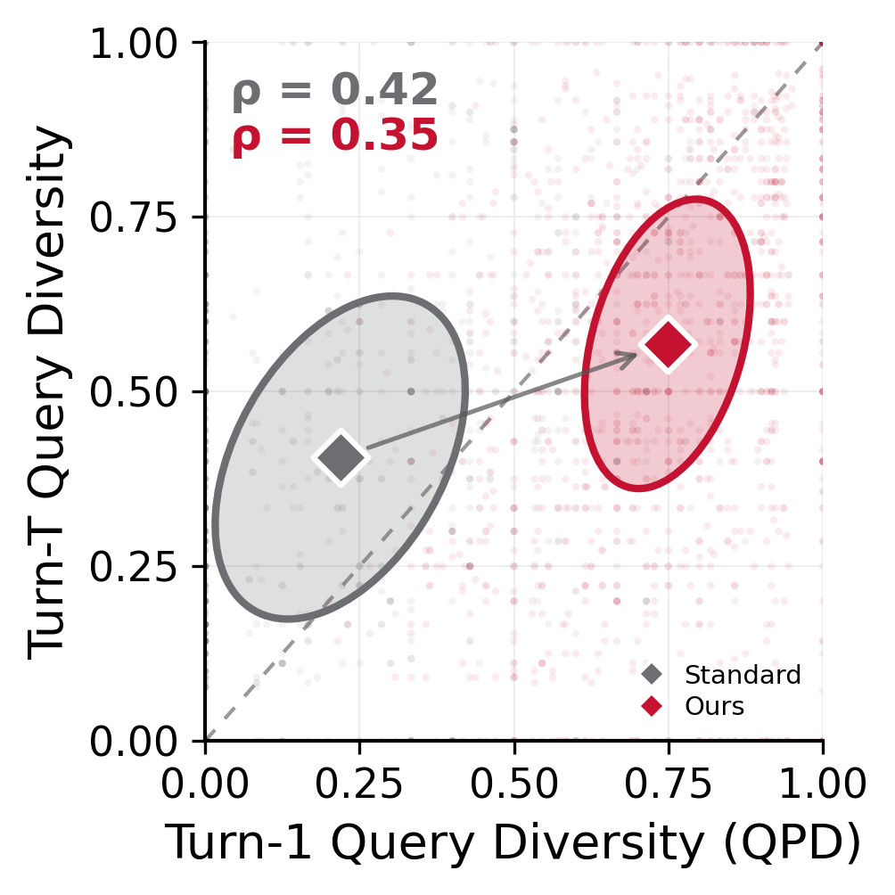
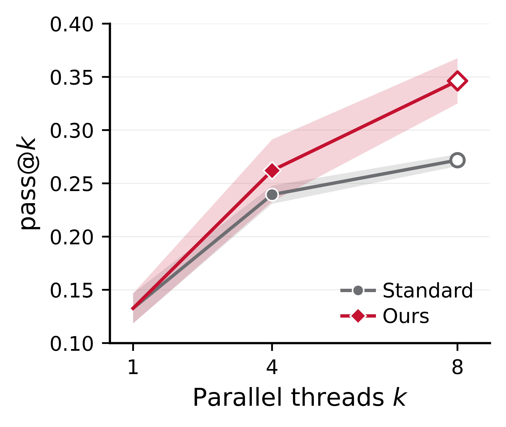

<h1 align="center">Beyond Parallel Sampling:<br>Diverse Query Initialization for Parallel Agentic Search</h1>

<div align="center">
<a href="https://github.com/sid-in-the-loop">Sid Murali</a>*,
Ethan Chi*,
<a href="#">João Coelho</a>

Language Technologies Institute, Carnegie Mellon University
</div>

<div align="center">

[](#citation)
[](./LICENSE)

</div>

---

## The Problem: Anchor Collapse

Parallel agentic search runs multiple search threads independently, hoping diversity in trajectories leads to better coverage. In practice, threads issue near-identical turn-1 queries — we call this **anchor collapse**. Because threads start from the same anchor, they retrieve overlapping documents and fail in correlated ways, wasting the benefit of parallelism.

<div align="center">
  
  <p><i>Turn-1 query diversity (QPD) strongly predicts full-trajectory diversity. Standard parallel sampling clusters queries (low QPD); DivInit forces spread.</i></p>
</div>

## Method: DivInit

**DivInit** breaks anchor collapse with a single training-free step: before launching threads, sample a pool of *k×m* candidate queries at temperature > 0, then greedily select *k* queries that maximise pairwise Jaccard distance. Each thread starts from a different seed.

- No fine-tuning, no reward model, no extra inference budget beyond pool generation
- Selection runs in milliseconds (token-level Jaccard, no embeddings needed)
- Plug-in compatible with any ReAct-style agent

## Results

DivInit consistently improves pass@k across models and benchmarks.

<div align="center">
  
  <p><i>pass@k vs. number of parallel threads k. DivInit (Ours) outperforms standard parallel sampling across all k values.</i></p>
</div>

Full results across 7 benchmarks (HotpotQA, MuSiQue, 2WikiMultihopQA, Bamboogle, FRAMES, GAIA, WebWalkerQA) and 6 models (Qwen3-1.7B/4B/8B, Gemma3-4B/12B, GPT-4o-mini) are in `results/`.

## Repository Structure

| Path | Description |
|------|-------------|
| `general_agent/webwalkerqa/` | Core agent, DivInit method, evaluation loop |
| `general_agent/data/main_table/` | Benchmark datasets (7 benchmarks) |
| `general_agent/scripts/` | SLURM launchers for all experiments |
| `results/main_table/` | Main table results (clueweb and serper backends) |
| `results/ablations/` | Oversample, pool-size, and temperature ablations |
| `paper_assets/figures/` | All paper figures with generation scripts |

## Getting Started

**Install:**
```bash
cd general_agent
pip install -e .
pip install litellm sentence-transformers httpx python-dotenv
```

**API keys** — create `general_agent/.env`:
```
OPENAI_API_KEY=...
SERPER_API_KEY=...
```

**Quick run:**
```bash
cd general_agent
python -m webwalkerqa.run.run_main_table \
  --model openai/gpt-4o-mini \
  --dataset data/main_table/hotpotqa.json \
  --condition diversity_parallel \
  --output-dir ../results/my_run
```

## Reproducing Results

**Closed models** (OpenAI / Gemini):
```bash
cd general_agent
bash scripts/submit_main_table.sh gpt-4o-mini
```

**Open models** (Qwen3, Gemma3 via vLLM) — see [`general_agent/HOW-TO-VLLM.md`](general_agent/HOW-TO-VLLM.md):
```bash
bash scripts/launch_vllm_server.sh Qwen/Qwen3-8B 8003
bash scripts/submit_main_table_open.sh qwen3-8b
```

**Ablations:**
```bash
bash scripts/submit_oversample_ablation.sh   # oversample-until-turn ablation
bash scripts/submit_poolsize.sh              # pool size sweep
bash scripts/submit_temperature_sweep.sh     # temperature sweep
```

## Citation

```bibtex
@inproceedings{murali2026divinit,
  title     = {Beyond Parallel Sampling: Diverse Query Initialization for Parallel Agentic Search},
  author    = {Murali, Sid and Chi, Ethan and Coelho, Jo{\~a}o},
  booktitle = {Proceedings of EMNLP},
  year      = {2026}
}
```

## License

MIT — see [LICENSE](LICENSE).
